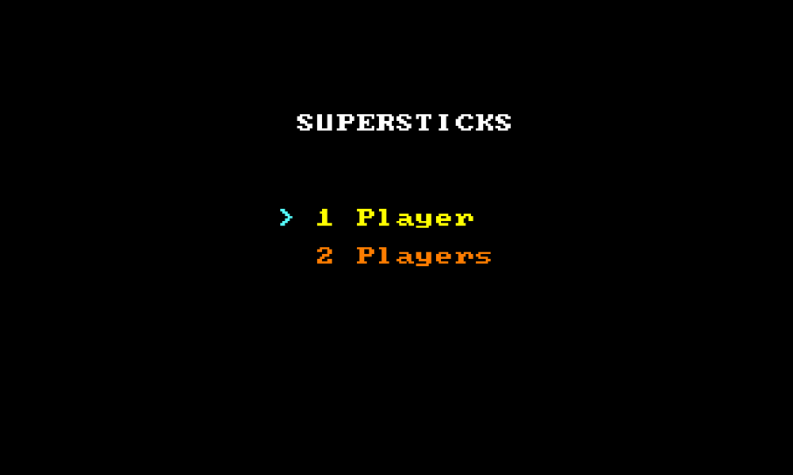

# Supersticks
## Overview
Game application in x86 assembly language.
## Rules
Players take from 1 to 3 sticks from board in turn. Player who took last stick loses.
## Build & Run
Use flat assembler (FASM) compiler to build application and any MS-DOS emulator to run it.
### Docker
- Build image with `docker build -t supersticks [--build-arg FASM_VERSION=<desired_fasm_version>] .`
- Run container with `docker run --name Supersticks -dp 8000:8000 supersticks`
- Navigate to http://127.0.0.1:8000
### Manual build
- Set `7-Zip` archiver path to `_7zip` variable in `config.bat.template`
- Set `FASM` compiler path to `_fasm` variable in `config.bat.template`
- Rename `config.bat.template` to `config.bat`
- Run `build.bat` script 
    - `build.bat` command compiles application
    - `build.bat release` command compiles application and puts binary into zip archive
### Manual run (using js-dos)
- Run `npm install --global http-server` to globally install `http-server` package from npm
- Run `build.bat release` to build application
- Run `start.bat` to start HTTP server
- Navigate to http://127.0.0.1:8080

